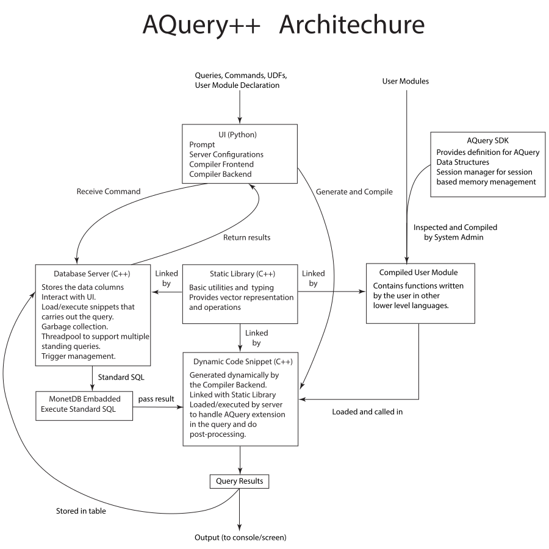

# AQuery++ Database
## Introduction

AQuery++ Database is a cross-platform, In-Memory Column-Store Database that incorporates compiled query execution. (**Note**: If you encounter any problems, feel free to contact me via ys3540@nyu.edu)

`## Docker (Recommended): 
   - See installation instructions from [docker.com](https://www.docker.com). Run **docker desktop** to start docker engine.
   - In AQuery root directory, type `make docker` to build the docker image from scratch. 
   - For Arm-based Mac users, you would have to build and run the **x86_64** docker image because MonetDB doesn't offer official binaries for arm64 Linux. (Run `docker buildx build --platform=linux/amd64 -t aquery .` instead of `make docker`)
   - Finally run the image in **interactive** mode (`docker run --name aquery -it aquery`) 
   - When you need to access the container again run `docker start -ai aquery` 
   - If there is a need to access the system shell within AQuery, type `dbg` to activate python interpreter and type `os.system('sh')` to launch a shell.
   - Docker image is available on [Docker Hub](https://hub.docker.com/repository/docker/sunyinqi0508/aquery) but building image yourself is highly recommended (see [#2](../../issues/2)) 
## CIMS Computer Lab (Only for NYU affiliates who have access)
  1. Clone this git repo in CIMS.
  2. Download the [patch](https://drive.google.com/file/d/1YkykhM6u0acZ-btQb4EUn4jAEXPT81cN/view?usp=sharing) 
  3. Decompress the patch to any directory and execute script inside by typing (`source ./cims.sh`). Please use the source command or `. ./cims.sh` (dot space) to execute the script because it contains configurations for environment variables. Also note that this script can only work with bash and compatible shells (e.g. dash, zsh. but not csh)
  4. Execute `python3 ./prompt.py`

## Singularity Container
 1. build container `singularity build aquery.sif aquery.def`
 2. execute container `singularity exec aquery.sif sh`
 3. run AQuery `python3 ./prompt.py`
# Native Installation:
## Requirements
1. Recent version of Linux, Windows or MacOS, with recent C++ compiler that has C++17 (1z) support. (however c++20 is recommended if available for heterogeneous lookup on unordered containers)
     - GCC: 9.0 or above (g++ 7.x, 8.x fail to handle fold-expressions due to a compiler bug)
     - Clang: 5.0 or above (Recommended)
     - MSVC: 2019 or later (2022 or above is recommended)

2. Monetdb for Hybrid Engine
   - On windows, the required libraries and headers are already included in the repo.
   - On Linux, see [Monetdb Easy Setup](https://www.monetdb.org/easy-setup/) for instructions.
   - On MacOS, Monetdb can be easily installed in homebrew `brew install monetdb`.

3. Python 3.6 or above and install required packages in requirements.txt by `python3 -m pip install -r requirements.txt` 

## Installation
AQuery is tested on mainstream operating systems such as Windows, macOS and Linux

### Windows
There're multiple options to run AQuery on Windows. But for better consistency I recommend using a simulated Linux environment such as **Windows Subsystem for Linux** (1 or 2), **Docker** or **Linux Virtual Machines**. You can also use the native toolchain from Microsoft Visual Studio or gcc from Winlabs/Cygwin/MinGW.

- Windows Subsystem for Linux (WSL, Recommended)
  - Install WSL2 from [Microsoft Store](https://aka.ms/wslstore)
  - Install Ubuntu 22.04 LTS from [Microsoft Store](https://apps.microsoft.com/store/detail/ubuntu-22041-lts/9PN20MSR04DW), you can use your favorite distro but make sure you know how to install MonetDB on it.
  - Select Linux and then ubuntu in [MonetDB Easy Setup](https://www.monetdb.org/easy-setup/)
  - Install Python 3.6 or above
  - Install required packages in requirements.txt by `python3 -m pip install -r requirements.txt` 
  - Run `python3 ./prompt.py` to start AQuery

- For Winlibs (Recommended):
  - Download latest winlibs toolchain from the [official website](https://winlibs.com/)
  - Since winlibs is linked with native windows runtime libraries (UCRT or MSVCRT), it offers better interoperatibility with other libraries built with MSVC such as python and monetdb.
  - Other steps can be either the same as Visual Studio or Cygwin/Mingw (below) without ABI break.
  - Copy or link `mingw64/libexec/gcc/<arch>/<version>/liblto-plugin.dll` to `mingw64/lib/bfd-plugins/` For Link time optimization support on gcc-ar and gcc-ranlib 
  
- For Visual Studio: 
    1. Install python3.6 or above from [official website](https://www.python.org/downloads/windows/) or Microsoft Store.
    2. Install Microsoft Visual Studio 2022 or later with **Desktop development with C++** selected.
    3. Clone AQuery repo from [Github](https://github.com/sunyinqi0508/AQuery2)
    4. Install python requirements with pip `python3 -m pip install -r requirements.txt`
    5. The libraries and headers for Monetdb are already included in msc-plugins, however you can also choose to download them from [Monetdb Easy Setup](https://www.monetdb.org/easy-setup/) and put them in the same place.

- For CygWin/MinGW:
   1. Install gcc and python3 using its **builtin package manager** instead of the one from python.org or windows store. (For Msys2, `pacman -S gcc python3`). Otherwise, ABI breakage may happen.
   2. Clone AQuery repo from Github
   3. Install python requirements
   4. The prebuilt binaries are included in ./lib directory. However, you could also rebuild them from [source](https://github.com/MonetDB/MonetDB).
   
### macOS
- If you're using an arm-based mac (e.g. M1, M2 processors). Please go to the Application folder and right-click on the Terminal app, select 'Get Info' and ensure that the 'Open using Rosetta' option is unchecked. See the section below for more notes for arm-based macs.
- Install a package manager such as [homebrew](https://brew.sh) 
- Install python3 and monetdb using homebrew `brew install python3 monetdb`
- Install C++ compiler come with Xcode commandline tool by `xcode-select --install` or from homebrew
- If you have multiple C++ compilers on the system. Specify C++ compiler by setting the **CXX** environment variable. e.g. `export CXX=clang`
- Install python packages from **requirements.txt**
  
**for arm64 macOS users**
- In theory, AQuery++ can work on both native arm64 and x86_64 through Rosetta. But for maximum performance, running native is preferred. 
- However, they can't be mixed up, i.e. make sure every component, `python` , `C++ compiler`, `monetdb` library and system commandline utilities such as `uname` should have the same architecture. 
- Use the script `./arch-check.sh` to check if relevant binaries all have the same architecture.
- In the case where binaries have different architectures, install the software with desired architecture and make an alias or link to ensure the newly installed binary is referred to. 
- Because I can't get access to an arm-based mac to fully test this setup, there might still be issues. Please open an issue if you encounter any problems.
  
### Linux
- Install monetdb, see [Monetdb Easy Setup](https://www.monetdb.org/easy-setup/) for instructions.
- Install python3, C++ compiler and git. (For Ubuntu, run `apt update && apt install -y python3 python3-pip clang-14 libmonetdbe-dev git `)
- Install required python packages by `python3 -m pip install -r requirements.txt`
- If you have multiple C++ compilers on the system. Specify C++ compiler by setting the **CXX** environment variable. e.g. `export CXX=clang++-14`
- Note for anaconda users: the system libraries included in anaconda might differ from the ones your compiler is using. In this case, you might get errors similar to: 
  >ImportError: libstdc++.so.6: version `GLIBCXX_3.4.26' not found 
   
   In this case, upgrade anaconda or your compiler or use the python from your OS or package manager instead. Or (**NOT recommended**) copy/link the library from your system (e.g. /usr/lib/x86_64-linux-gnu/libstdc++.so.6) to anaconda's library directory (e.g. ~/Anaconda3/lib/).


# Usage
`python3 prompt.py` will launch the interactive command prompt. The server binary will be automatically rebuilt and started.
### Commands:
- `<sql statement>`: parse AQuery statement
- `f <filename>`: parse all AQuery statements in file
- `exec`: execute last parsed statement(s) with Hybrid Execution Engine. Hybrid Execution Engine decouples the query into two parts. The standard SQL (MonetDB dialect) part is executed by an Embedded version of Monetdb and everything else is executed by a post-process module which is generated by AQuery++ Compiler in C++ and then compiled and executed.
- `stats <OPTIONAL: options>` configure statistics.
  - no options: show statistics for all queries so far.
  - `reset`: resets statistics.
  - `on` : statistics will be shown for every future query.
  - `off`: statistics will not be shown for every future query.
- `script <filename>`: use automated testing script, this will execute all commands in the script
- `sh <OPTIONAL: shell>` launch a shell. Shell name can be specified (e.g. `sh fish`).
- `dbg` start python interactive interpreter at the current context. 
- `print`: print parsed AQuery statements (AST in JSON form)
- `save <OPTIONAL: filename>`: save current code snippet. will use random filename if not specified.
- `exit`: quit the prompt
- `r`: run the last generated code snippet
## Example:
   `f moving_avg.a` <br>
   `xexec`

See files in ./tests/ for more examples. 

## Automated Testing Scripts
- A series of commands can be put in a script file and execute using `script` command.
- Can be executed using `script` command
- See `test.aquery` as an example

# User Manual
AQuery++ has similar syntax to standard SQL with extensions for time-series analysis and user extensibility.
## Basic Grammar
```
program : [query | create | insert | load | udf ]*

/********* Queries *********/
query : [WITH ID ['('columns')'] AS '(' single-query ')'] single-query

single-query : SELECT projections FROM datasource assumption where-clause groupby-clause

projections: [val as ID | val] (, [val as ID | val])*

datasource : ID [ID | AS ID] |
  ID, datasource |
  ID [INNER] JOIN datasource [USING columns | ON conditions] |
  ID NATURAL JOIN datasource

order-clause: ASSUMING ([ASC|DESC] ID)+

where-clause: WHERE conditions;

groupby-clause: GROUP BY expr (, expr )* [HAVING conditions]

conditions: <a boolean expression>

/********* Creating data *********/
create: CREATE TABLE ID [AS query | '(' schema ')']
schema: ID type (, ID type)*

insert: INSERT INTO ID [query | VALUES '(' literals ')']
literals: literal (, literal)*;

/********* Loading/Saving data *********/
load: LOAD DATA INFILE string INTO TABLE ID FIELDS TERMINATED BY string

save: query INTO OUTFILE string FIELDS TERMINATED BY string

/********* User defined functions *********/
udf: FUNCTION ID '(' arg-list ')' '{' fun-body '}'
arg_list: ID (, ID)*
fun_body: [stmts] expr
/********* See more udf grammar later. **********/

stmts: stmt+ 
stmt: assignment; | if-stmt | for-stmt | ;
assignment: l_value := expr
l_value: ID | ID '[' ID ']'

if-stmt: if '(' expr ')' if-body [else (stmt|block) ]
if-body: stmt | block (elif '(' expr ')' if-body)*

for-stmt: for '(' assignment (, assignment)* ';' expr ';' assignment ')' for-body
for-body: stmt|block

block:  '{' [stmts] '}'

/********* Expressions *********/
expr: expr binop expr | fun_call | unaryop expr | ID | literal
fun: ID | sqrt | avg[s] | count | deltas | distinct 
  | first | last | max[s] | min[s] | next
  | prev | sum[s] | ratios | <... To be added> 
fun_call: fun '(' expr (, expr)* ')'
binop: +|-|=|*|+=|-=|*=|/=|!=|<|>|>=|<=| and | or
unaryop: +|-| not
literal:  numbers | strings | booleans

```
## Data Types
- String Types: `STRING` and `TEXT` are variable-length strings with unlimited length. `VARCHAR(n)` is for strings with upper-bound limits.
- Integer Types: `INT` and `INTEGER` are 32-bit integers, `SMALLINT` is for 16-bit integers, `TINYINT` is for 8-bit integers and `BIGINT` is 64-bit integers. On Linux and macOS, `HGEINT` is 128-bit integers. 
- Floating-Point Types: `REAL` denotes 32-bit floating point numbers while `DOUBLE` denotes 64-bit floating point numbers. 
- Temporal Types: `DATE` only supports the format of `yyyy-mm-dd`, and `TIME` uses 24-hour format and has the form of `hh:mm:ss:ms` the milliseconds part can range from 0 to 999, `TIMESTAMP` has the format of `yyyy-mm-dd hh:mm:ss:ms`. When importing data from CSV files, please make sure the spreadsheet software (if they were used) doesn't change the format of the date and timestamp by double-checking the file with a plain-text editor.
- Boolean Type: `BOOLEAN` or `BOOL` is a boolean type with values `TRUE` and `FALSE`.

## Create Table
Tables can be created using `CREATE TABLE` statement. For example
```
CREATE TABLE my_table (c1 INT, c2 INT, c3 STRING)
INSERT INTO my_table VALUES(10, 20, "example")
INSERT INTO my_table SELECT * FROM my_table
```
You can also create tables using a query. For example:
```
CREATE TABLE my_table_derived
AS
  SELECT c1, c2 * 2 as twice_c2 FROM my_table
```
## Drop Table:
Tables can be dropped using `DROP TABLE` statement. For example:
```
DROP TABLE my_table IF EXISTS
```
## Load Data:
- Use query like `LOAD DATA INFILE <filename> INTO <table_name> [OPTIONS <options>]`
- File name is the relative path to the AQuery root directory (where prompy.py resides)
- File name can also be absolute path.
- See `data/q1.sql` for more information 

## Built-in functions: 
- `avg[s]`: average of a column. `avgs(col), avgs(w, col)` is rolling and moving average with window `w` of the column `col`.
- `sum[s]`, `max[s]`, `min[s]`: similar to `avg[s]`
- `ratios(w = 1, col)`: moving ratio of a column, e.g. `ratios(w, col)[i]=col[i-w]/col[i]`. Window `w` has default value of 1.  
- `next(col), prev(col)`: moving column back and forth by 1, e.g. `next(col)[i] = col[i+1]`.
- `first(col), last(col)`: first and last value of a column, i.e. `first(col)= col[0]`, `last(col) = col[n-1]`.
- `sqrt(x), trunc(x), and other builtin math functions`: value-wise math operations. `sqrt(x)[i] = sqrt(x[i])`
- `pack(cols, ...)`: pack multiple columns into a single column. 

# Architecture 


## AQuery Compiler
- The query is first processed by the AQuery Compiler which is composed of a frontend that parses the query into AST and a backend that generates target code that delivers the query.
- Front end of AQuery++ Compiler is built on top of [mo-sql-parsing](https://github.com/klahnakoski/mo-sql-parsing) with modifications to handle AQuery dialect and extension.
- Backend of AQuery++ Compiler generates target code dependent on the Execution Engine. It can either be the C++ code for AQuery Execution Engine or sql and C++ post-processor for Hybrid Engine or k9 for the k9 Engine.
## Execution Engines
- AQuery++ supports different execution engines thanks to the decoupled compiler structure.
- Hybrid Execution Engine: decouples the query into two parts. The sql-compliant part is executed by an Embedded version of Monetdb and everything else is executed by a post-process module which is generated by AQuery++ Compiler in C++ and then compiled and executed.
- AQuery Library: A set of header based libraries that provide column arithmetic and operations inspired by array programming languages like kdb. This library is used by C++ post-processor code which can significantly reduce the complexity of generated code, reducing compile time while maintaining the best performance. The set of libraries can also be used by UDFs as well as User modules which makes it easier for users to write simple but powerful extensions. 
  
# Roadmap
- [x] SQL Parser -> AQuery Parser (Front End)
- [x] AQuery-C++ Compiler (Back End)
   -  [x] Schema and Data Model 
   -  [x] Data acquisition/output from/to csv file
- [ ] Execution Engine
  - [x] Single Query
     -  [x] Projections and single-group Aggregations 
     -  [x] Group by Aggregations
     -  [x] Filters
     -  [x] Order by
     -  [x] Assumption
     -  [x] Flatten
     -  [x] Join (Hybrid Engine only)
  - [ ] Subquery
     -  [ ] With Clause
     -  [ ] From subquery
     -  [ ] Select sunquery
     -  [ ] Where subquery
     -  [ ] Subquery in group by
     -  [ ] Subquery in order by
- [x] Query Optimization
  - [x] Selection/Order by push-down
  - [x] Join Optimization (Only in Hybrid Engine)
  - [ ] Threaded GC
- [ ] Extensibility 
  - [x] UDFs (Hybrid Engine only)
  - [x] SDK and User Module 
  - [ ] Triggers 

# Known Issues:

- [ ] Interval based triggers
- [ ] Hot reloading server binary
- [x] Bug fixes: type deduction misaligned in Hybrid Engine
- [ ] Investigation: Using postproc only for q1 in Hybrid Engine (make is_special always on)
- [ ] C++ Meta-Programming: Eliminate template recursions as much as possible.
- [x] Functionality: Basic helper functions in aquery 
- [ ] Bug: Join-Aware Column management
- [ ] Bug: Order By after Group By
- [ ] Functionality: Having clause, With clause
- [ ] Decouple expr.py
